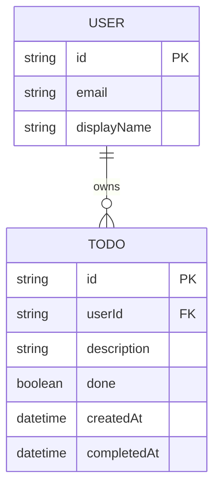

# Domain Model

The model is deliberately small: a signed-in User owns a private list of Todo items, each of which is either open or done.

- `USER` is the identity Thunder authenticates; `todo-api` never manages user records itself — it only scopes `TODO` rows by the signed-in user's id.
- `TODO.done` starts `false` and can only move to `true` — there is no un-done and no edit of `description` after creation.
- `completedAt` is set when `done` transitions to `true`.

