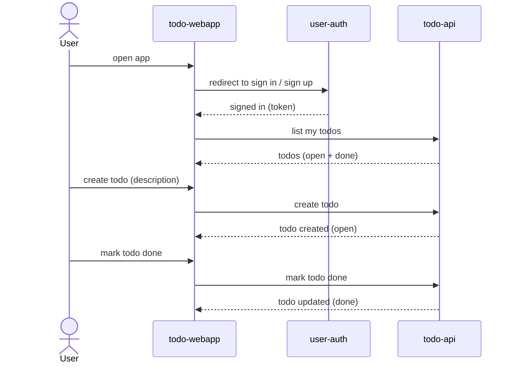

# Manage Todos

A signed-in User creates a todo and later marks it done; sign-in itself is handled by the platform IDP before the app is reached.

```mermaid
sequenceDiagram
    actor User
    participant webapp as todo-webapp
    participant auth as user-auth
    participant api as todo-api

    User->>webapp: open app
    webapp->>auth: redirect to sign in / sign up
    auth-->>webapp: signed in (token)
    webapp->>api: list my todos
    api-->>webapp: todos (open + done)
    User->>webapp: create todo (description)
    webapp->>api: create todo
    api-->>webapp: todo created (open)
    User->>webapp: mark todo done
    webapp->>api: mark todo done
    api-->>webapp: todo updated (done)
```

